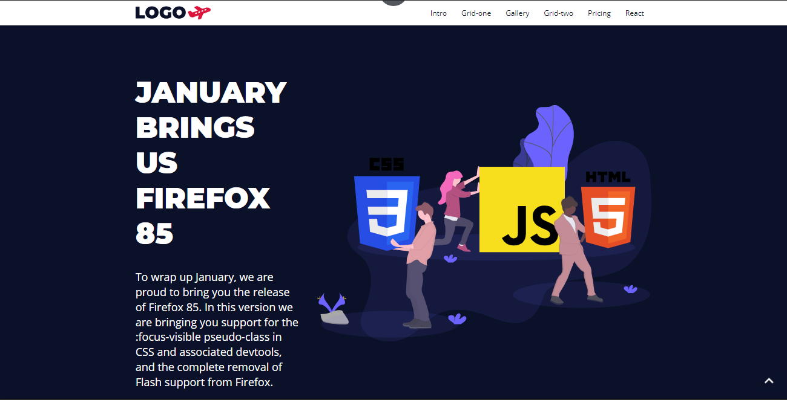

<h1 align="center">Landing Page</h1>

<p align="center">
    
</p>

<br>

## 🧪 Tecnologias

Esse projeto foi desenvolvido com as seguintes tecnologias:

- [React](https://reactjs.org)
- [Storybook](https://storybook.js.org/)
- [Strapi](https://strapi.io/)
- [Jest](https://jestjs.io/)

## 🚀 Como executar

Clone o projeto e acesse a pasta do mesmo.

```bash
$ git clone https://github.com/morricedev/landing-page
$ cd landing-page
```

Para iniciá-lo, siga os passos abaixo:

```bash
# Instalar as dependências
$ yarn

# Iniciar o projeto
$ yarn start
```

O app estará disponível no seu browser pelo endereço http://localhost:3000.

O gerenciamento da página é feito através do Strapi, que é um CMS Headless.

## 💻 Projeto

O projeto é perfeito para a criação de landing pages dinâmicas com um layout moderno e responsivo.

Você pode visualizar o projeto através do link abaixo:

<br />

**Se demorar de carregar, aguarde um pouquinho. O servidor, no qual está hospedado o backend, desliga quando a página não está recebendo acessos =)**

- [Landing Page](https://adoring-raman-7c9961.netlify.app/)


---

Feito com 💜 by Morrice 👋🏻
